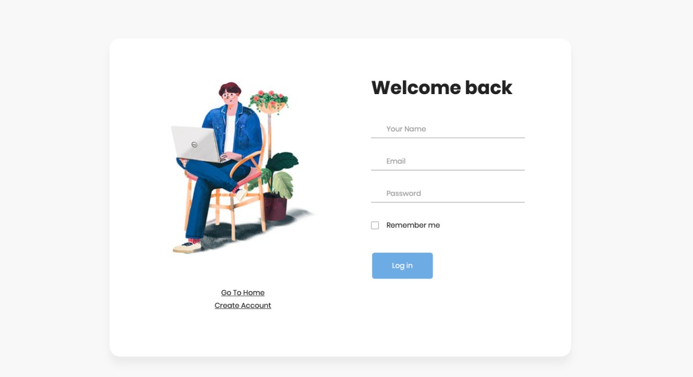
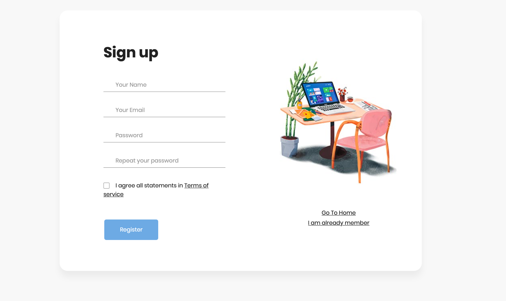
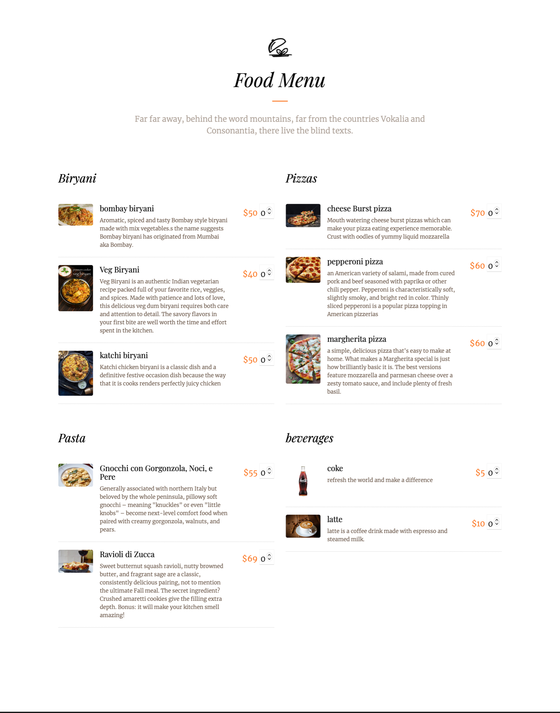
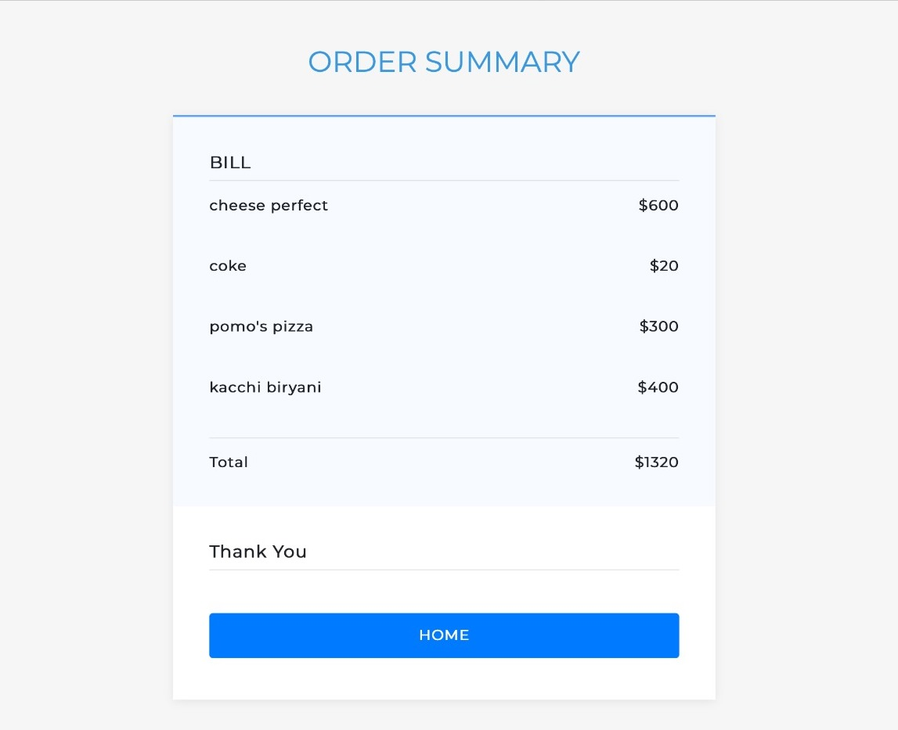

# Restaurants Site With Dynamic Menu Management

A robust back-end and a responsive front-end, delivering an intuitive and efficient user experience.


## Tech Stack

**Frontend:** Javascript, HTML, CSS, Bootstrap

**Backend:** Python , Django , MySQL / Postgres SQL

*Note : For a comprehensive understanding of the database structure, please refer to the design document PDF located in this repository.*

## Authors 

- [Nisarg Patel](nisarg.b.patel59@gmail.com)


## Screenshots 


* **Home Page**


* **SignIn && SignUP**

<table>
  <tr>
    <td>Sign IN</td>
     <td>Sign UP</td>
  </tr>
  <tr>
    <td></td>
    <td></td>
  </tr>
 </table>


* **Menu**



* **Checkout**



## Installation and Setup

Install my-project with npm


PYTHON : 3.8.5 

INSTALL DJANGO

```
conda install django
```

Download and install PostgreSQL 
from https://www.postgresql.org/download/ according to your system

Install pgAdmin 4 
from https://www.pgadmin.org/download/ if not installed during installation of postgresql

Install PSYCOG2 - PostgreSQL python connector
```
conda install psycopg2
```

Install PILLOW - Python Imaging Library 
```
conda install pillow
```

Setup Database

create a database PSC_assginment in pgadmin
and set a password

now change the password in DATABASES dictionary in 
PSC_assignment/PSC_assignment/setting.py
to the password you set in the pgdamin database

now migrate and set changes, run
```
python manage.py makemigrations
python manage.py migrate
to save all the changes
```

For admin login
```
python manage.py createsuperuser
```

set admin username and password

## Run Locally

```
python manage.py runserver
```
this will run the site at the localhost address, which will be shown in the termianl window 
open that link in browser to show the project

***********************************************************

FOR FUNCTIONALITIES 
1. Adding fooditems in menu or featured dishes 

redirect to the admin site by 
changing localhost:xxxx to localhost:xxx/admin

here you will be asked to enter username and password for admin 
enter the password and username you entered while creating a superuser

now you will be shown 
Featured_dishess
Food_items
Item_typess	

add items there and change will be shown directly on main site 

2. Login and Signup 

Without login you won't be shown the checkout option after selecting items from the menu

To checkout first login,
to login,
use the Login in homepage 
and you will be redirected to the login page, if you don't have and account first sign up

Now after login you will be redirected automatically to the homepage 
where the checkout button will be visible if login was successfull

Select the fooditems and click on checkout to place an order 
on cliking you will be show the bill dynamically

